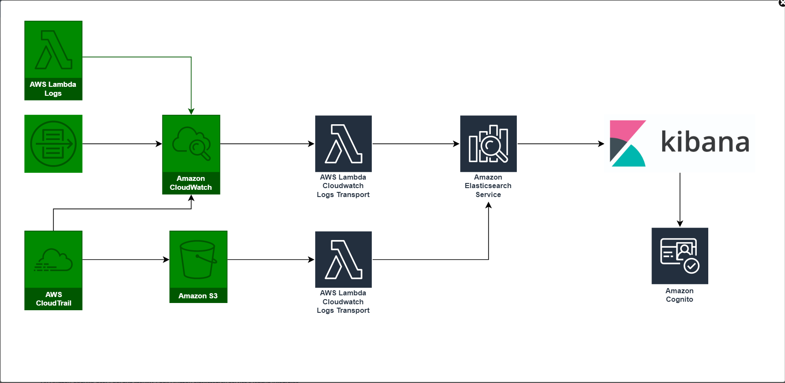

# Terraform Code For ELK Stack (Work in progress)

Deploy a ELK Stack with Terraform

## What resources are created

1. VPC
2. Internet Gateway (IGW)
3. Public and Private Subnets
4. Security Groups, Route Tables and Route Table Associations
5. IAM roles, instance profiles and policies
6. An Elastic Search Service Cluster
7. Autoscaling group and Launch Template
8. S3 Bucket for audit trail logs
9. lambda funtion for wiring Kibana and Cognito, for transfer VPC-flow-log/cloudtrail logs from cloudwatch logs to Elastic Search
10. Cognito User pool, Identity Pool
11. Cloudwatch log groups
12. Cloudwatch logs subscriptions
13. Cloudtrail
14. vpc flow logs


----

## How to use this example

```bash
git clone git@github.com:nitinda/terraform_code_elk_stack.git
cd terraform_visualize_cloudtrails/layer
terraform init
terraform plan
terrafomr apply --auto-approve
```


## Manual Steps post deployment

```
- Deployed Lambda function (i.e. terraform-demo-lambda-wiringfunction) needs to be executed before accessing the kibana
    - Create test evnet, this function will create Cognito user (i.e. - kibana default password : Abcd1234!)
```

----

## Diagram




----

## Cleaning up

You can destroy this cluster entirely by running:

```bash
terraform plan -destroy
terraform destroy --force --auto-approve
```